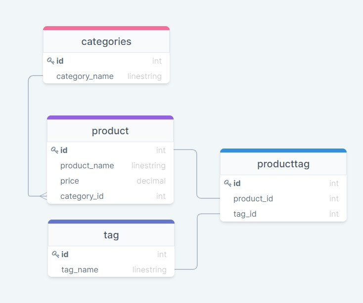

# E-Commerce_backend

## Description

This is a node application that utilizes Sequelize (MySQL specifically) and Express to make a backend for an e-commerce website. Currently there is no front end views, but all the respective routes have been set up. A demonstration of setting up the database, and using the routes can be found [here](https://youtu.be/ytksjyKNKtk).

## Features

* Models for Categories, Products and Tags, as well as their associated relations.
* Routes for GET, POST, PUT, and DELETE requests for all the models.
* Seed data script to seed the database with some test data.
* Secure db, username and password files through enviroment variables.

## Database Relations



## Installation

1. Make sure you have [Node JS](https://nodejs.dev/) installed on your machine.
2. Clone or download the repository.
3. Navigate to the repository folder on your local machine in the command line and run:
```
    npm install
```
4. After all the dependencies are installed, create an .env file in the root directory, and set it up like so:
```
    DB_USER=yourUsernameHere
    DB_PW=yourPasswordHere
    DB_NAME=ecommerce_db            // This MUST be ecommerce_db for this app to work.
```
5. In the `/db` folder, there is a schema.sql file that you can run in MySQL workbench (or equivalent) to set up the initial database:


6. Back in the command line, run the following to seed the database:
```
    npm run seed
```
7. Finally, to start the application, run:
```
    npm start
```

## Running Requests

To run requests while the application is running, you will need an API client such as [Postman](https://www.postman.com/) or [Insomnia](https://insomnia.rest/) since there is currently no front end. The respective routes that you make requests to are found in `/routes/api`. Below is an example of a GET request made in Insomnia:


Remember to make requests to `http://localhost:3001` when you run this application locally since that is the default port for the application.